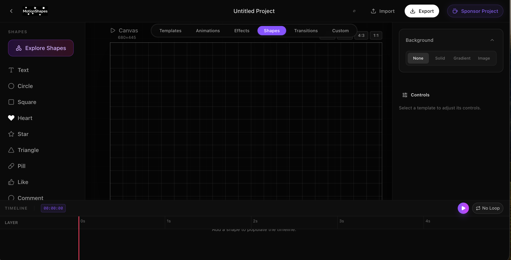
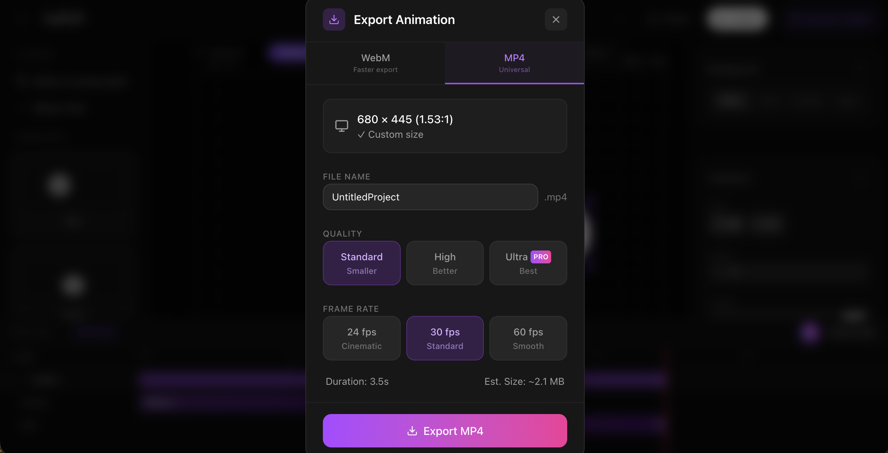

# MotionShapes

[](https://www.motionshapes.com)
[](https://www.gnu.org/licenses/agpl-3.0)

**MotionShapes** ([www.motionshapes.com](https://www.motionshapes.com)) is a modern, blazing-fast web-based design tool that allows users to create stunning, animated 2D shapes and interactive motion graphics right in their browser. 

Whether you need a dynamic hero asset for your landing page, a text animation sequence, or a complex particle effect, MotionShapes gives you a powerful visual node editor to build it, animate it, and export it as an optimized MP4 or WebM video—all without leaving the browser.

---

## 📸 Screenshots & Demos


> *The interactive 2D canvas and property editor.*


> *Exporting high-quality animations entirely in the browser.*
### 🎥 Video Demo
https://github.com/deep1283/Motionshapes/raw/main/public/demo.mp4

---

## 🚀 Tech Stack

- **Framework:** [Next.js](https://nextjs.org/) (App Router)
- **Styling:** [Tailwind CSS](https://tailwindcss.com/)
- **UI Animations:** [Framer Motion](https://www.framer.com/motion/)
- **WebGL / Rendering:** [Pixi.js](https://pixijs.com/)
- **Video Export:** [FFmpeg WebAssembly](https://ffmpegwasm.netlify.app/)
- **Local Storage:** IndexedDB (idb-keyval)
- **Payments / Sponsorship:** [Dodo Payments](https://www.dodopayments.com/)

---

## 💻 Installation

To run MotionShapes locally on your machine:

1. **Clone the repository:**
   ```bash
   git clone https://github.com/yourusername/motionshapes.git
   cd motionshapes
   ```

2. **Install dependencies:**
   ```bash
   npm install
   ```

3. **Set up environment variables:**
   Create a `.env.local` file and add your Google Gemini and Dodo Payments keys (see `.env.example` if available).

4. **Start the development server:**
   ```bash
   npm run dev
   ```

5. **Open the app:**
   Navigate to [http://localhost:3000](http://localhost:3000) in your browser.

---

## 🧠 What Makes This Interesting? (Architecture)

MotionShapes pushes the boundaries of what is possible entirely inside a web browser without relying on expensive cloud rendering servers. 

### 🎨 Rendering: Pixi.js
Instead of traditional DOM elements, the core canvas relies on **Pixi.js** for hardware-accelerated 2D WebGL rendering. This allows us to push thousands of particles, complex vector filters (glow, drop shadow, pixelation), and intricate motion tracking smoothly at 60FPS.

### 🎬 Video Export: FFmpeg WASM
The most technically complex feature is the export engine. Instead of sending frame data to a backend server to be encoded (which is slow and expensive), we use **FFmpeg compiled to WebAssembly (WASM)**. The user's browser captures the Pixi.js canvas frame-by-frame and encodes a high-quality MP4 or WebM video *locally* on their own CPU.

### ⚡ Front-end: Next.js + Framer Motion
The surrounding application wrapper and UI panels are built with **Next.js** for optimal routing and SEO, while **Framer Motion** drives the fluid, native-feeling UI transitions between configuration states.

### 💾 Local-First Storage
We designed a fully local storage model. Active drafts and high-frequency canvas saves are written directly to the browser's **IndexedDB**. This ensures the editor feels instantaneous, works offline, and respects user privacy by never sending design data to a cloud database.

---

## 🤝 Contributing

We welcome community contributions! Whether it's a new 2D shape preset, an optimization for the WASM encoder, or a bug fix, we'd love your help.

Please see our [Contribution Guidelines](CONTRIBUTING.md) for details on how to get started.

---

## 📄 License

This project is licensed under the **GNU Affero General Public License v3.0 (AGPLv3)**. See the [LICENSE](LICENSE) file for the full text. 

*(TL;DR: You are free to use, modify, and distribute this software, but if you run it as a public service over a network, you must open-source your modifications under the same license.)*
